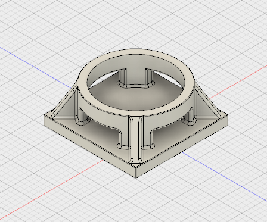

# Cable tie base

# Files
* Sources: Source files of the desing.
* STL: Stl files ready to print.
* STP: Step files for import in any design program.

# Designed with
This file have designed with Autodesk Fusion360 2.0.2535 Student version.

# Designed by
This file have designed by Santiago López.

# License

This designs are licensed under a [Creative Commons Attribution-ShareAlike 4.0 International License](http://creativecommons.org/licenses/by-sa/4.0/)
