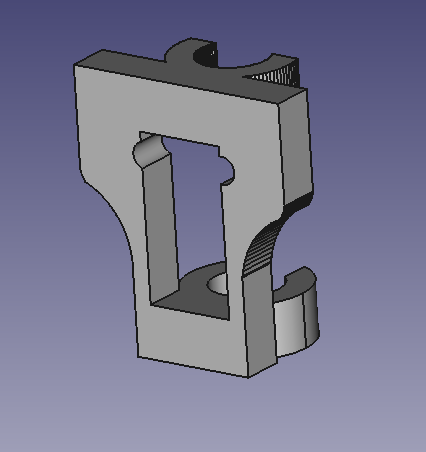

# Z endstop

# Files
* FCStd: Source files
* STL: Stl files ready to print
* STP: Step files for import in any design program

# Designed with
This file have designed with Freecad 0.16

# Designed by
This file have designed by Santiago López.
# License

This designs are licensed under a [Creative Commons Attribution-ShareAlike 4.0 International License](http://creativecommons.org/licenses/by-sa/4.0/)
